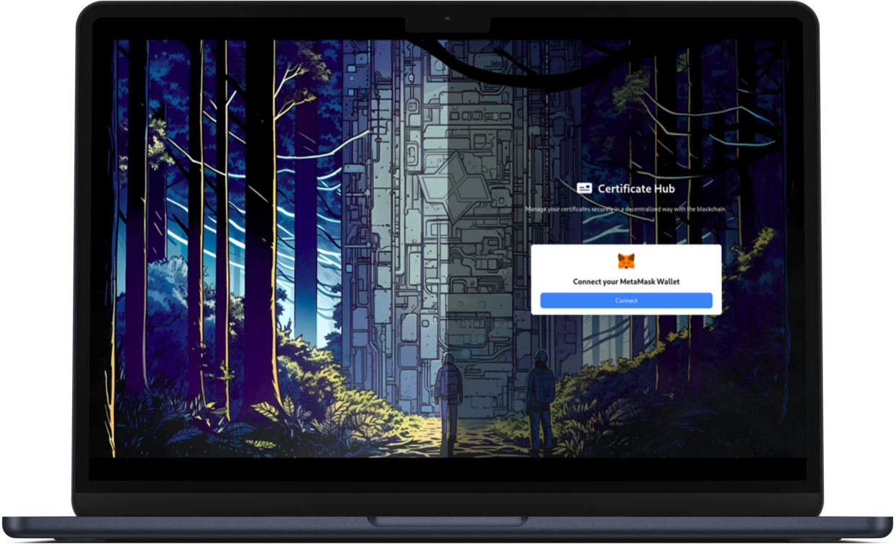
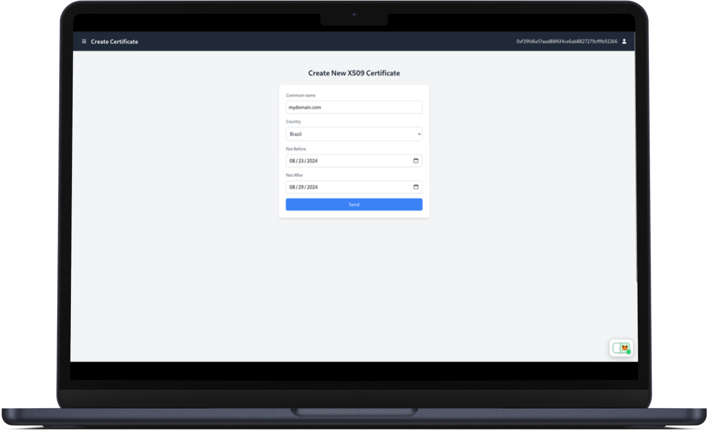
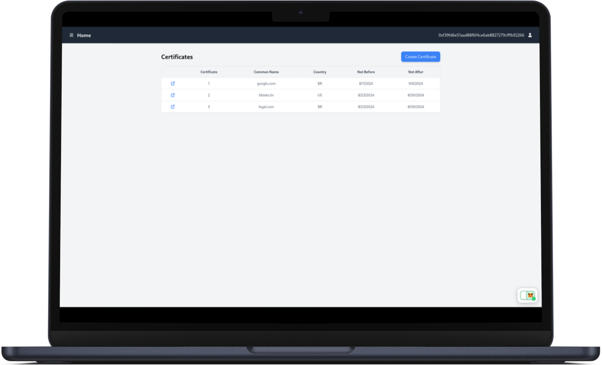

<p align="center"></p>

<br>

<p align="center">
   <br/>
  <a href="https://github.com/mateus-sartorio/descentralized-pik-with-blockchain-frontend"><kbd>🔵 GitHub</kbd></a>
</p>

# 🪪 Certificate Hub (Front End)

### Decentralized certificates.

<br/>

## 🔥 Features

### 📜 Create new certificates in a descentralized way

<div align="center">
  
</div>

### 📜🔍 View created certificates

<div align="center">
  
</div>

<br>

## 🍄 Philosophy

This project is intended to be simple and easy to use. The functionalities are kept minimal but refined.

<br/>

## ⚙️ Configure and run locally

### Prerequisites:

- Backend dApp running ([Setup Instructions](https://github.com/mateus-sartorio/descentralized-pik-with-blockchain-backend))
- Metamask test wallet on browser ([Setup Instructions](https://github.com/mateus-sartorio/descentralized-pik-with-blockchain-backend))
- Node.js 18 or above ([Instalation instructions](https://nodejs.org))
- Yarn ([Instalation instructions](https://classic.yarnpkg.com/lang/en/docs/install/#debian-stable))

Before starting, make sure you have all the prerequisites to run the project.

To check the Node.js version installed on your machine, run the following command:

```bash
node --version
```

> [!TIP]
> If your Node.js version is not 18 or above, it is recommended to use `nvm`, which allows you to install and manage multiple versions of Node.js on your machine.
>
> [Repository with installation instructions](https://github.com/nvm-sh/nvm)


After installing Node.js, install Yarn package manager:

```bash
npm install --global yarn
```


### Running the application

Clone the repository locally. Then, navigate to the directory of the cloned repository:

```bash
git clone https://github.com/mateus-sartorio/descentralized-pik-with-blockchain-frontend frontend
cd frontend
```

In the project directory, run:

```bash
yarn
yarn start
```

If everything went well, you are now running the app in the development mode. Open [http://localhost:3000](http://localhost:3000) to view it in the browser.

<br/>


## ⚠️ Limitations

- When changing the dApp address in the settings page, the Front End continues to use the default address. This happens because the address configuration page and the input submission page are separate, and to share state between two pages in React, you need to set up a Redux store, which hasn't been done in the project.


## 🐞 Known bugs

- Sometimes the reference to the MetaMask wallet is lost in the application (for unknown reasons), and the user needs to log out and log back in to continue.

- Sometimes, when logging out, an error is thrown, and the user needs to navigate to the `/` route to log in again.

<br/>


## ⚖️ License:

Copyright Universidade Federal do Espirito Santo (Ufes)

This program is free software: you can redistribute it and/or modify it under the terms of the GNU General Public License as published by the Free Software Foundation, either version 3 of the License, or (at your option) any later version.

This program is distributed in the hope that it will be useful, but WITHOUT ANY WARRANTY; without even the implied warranty of
MERCHANTABILITY or FITNESS FOR A PARTICULAR PURPOSE.  See the GNU General Public License for more details.

You should have received a copy of the GNU General Public License along with this program.  If not, see <https://www.gnu.org/licenses/>.

This program is released under license GNU GPL v3+ license.


## 🛟 Support:

Please report any issues with the application at [github.com/mateus-sartorio/descentralized-pik-with-blockchain-frontend](https://github.com/mateus-sartorio/descentralized-pik-with-blockchain-frontend).
